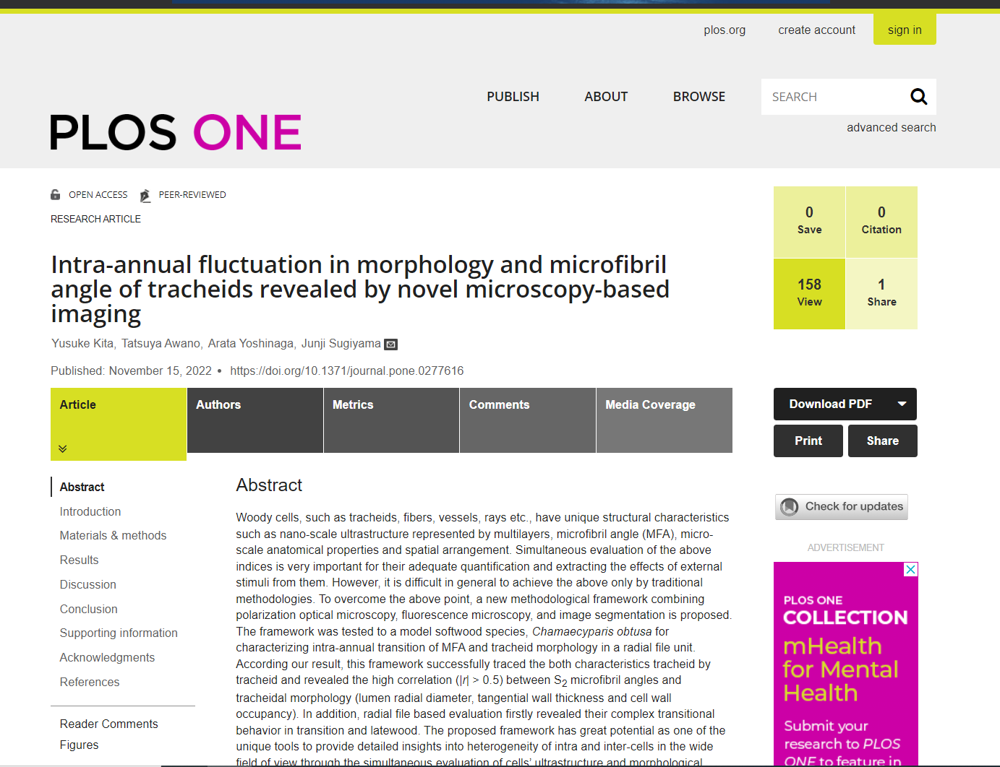
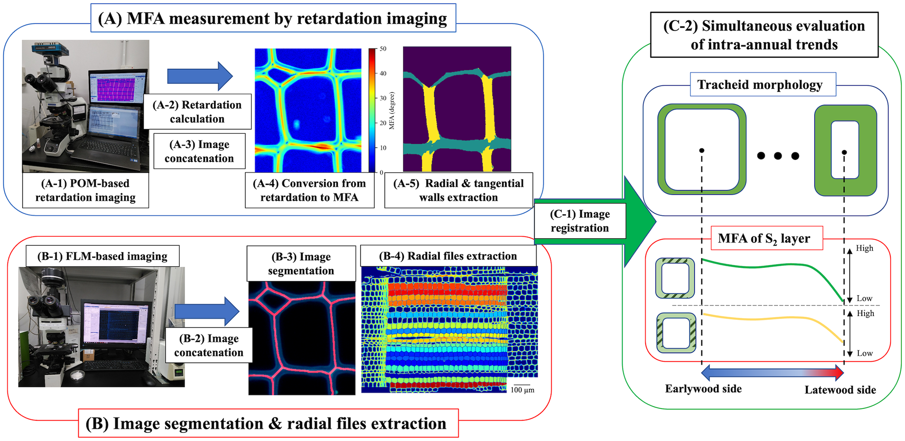

# po_mfa_2022
Softwares developped by pywood21: 

Source: Yusuke Kita, Tatsuya Awano, Arata Yoshinaga and Junji Sugiyama: Intra-annual fluctuation in morphology and microfibril angle of tracheids revealed by novel microscopy-based imaging. <br>

URL: [Click here](https://journals.plos.org/plosone/article?id=10.1371/journal.pone.0277616) <br>




Part I: a new CV technique combining polarization optical microscopy, fluorescence microscopy, and image segmentation.

Part II: X-ray fiber diffraction analysis to measure MFA by peak deconvolution method.


# Part I

## Radial file based evaluation of softwood cell anatomy and MFA.

This part corresponds to a series of image analyses techniques, image concatenation, image registration, image segmentation and MFA image creation.  Image analysis follows the procedure shown in original paper (See Fig.1).<br>

<br>

Python files and jupyter notebooks for Image manipulation corresponding to each step are listed below. <br>

How to use each files is commented in each file.<br>

&nbsp;

1. **Manipulation of FLM images (step B-2 - B-4 in Fig.1)** <br>

   - **Image concatenation**:<br>[Stitcher.py](./common/Stitcher.py)<br>

   - **Watershed segmentation**: <br> [Watershed_func.py](./common/Watershed_func.py)<br>

   - **Radial file extraction**: <br>

     [Radial_file_extraction.py](./common/Radial_file_extraction.py) <br>

   - **Step B-2**:<br> [P01_FLM_stitching.ipynb](./jupyternotebooks/POM&FLM/P01_FLM_stitching.ipynb)<br>

   - **Step B-3**:<br>[P02_watershed_segmentation_with_ray_extraction.ipynb](./jupyternotebooks/POM&FLM/P02_watershed_segmentation_with_ray_extraction.ipynb)<br>[P03-1_stitching_manual_correction_image.ipynb](./jupyter_notebooks/POM&FLM/P03-1_stitching_manual_correction_image.ipynb)<br>[P03-2_creating_GT_im_by_denoising.ipynb](./jupyter_notebooks/POM&FLM/P03-2_creating_GT_im_by_denoising.ipynb)<br>

   - **Step B-4**:<br>[P07_RAG_drawing_radial_file_extraction.ipynb](./jupyternotebooks/POM&FLM/P07_RAG_drawing_radial_file_extraction.ipynb)<br>

&nbsp;

2. **Manipulation of POM image (step A-2 - A-5 in Fig.1)** <br>

   - **Image concatenation**: <br>

     [Stitcher.py](./common/Stitcher.py)<br>

   - **PolScope conversion**: <br>

     [Ret_MFA_func.py](./common/Ret_MFA_func.py) <br>

   - **Step A-2 - A-4**: <br>

     [P04_polscope_conversion_&_image_stitching_for_x40.ipynb](./jupyter_notebooks/POM%26FLM/P04_polscope_conversion_%26_image_stitching_for_x40.ipynb)<br>

   - **Step A-5**:

     [P09_extract_each_layer_contribution.ipynb](./jupyter_notebooks/POM&FLM/P09_extract_each_layer_contribution.ipynb)<br>

&nbsp;

3. **Simultaneous evaluation of tracheid anatomy and MFA based on radial file units (step C-1 and C-2 in Fig.1)** <br>

   - **Image registration**: <br>

     [Stitcher.py](./common/Stitcher.py)<br>

   - **Step C-1**:<br>

     [P05_FLM_polscope_image_matching_for_x40.ipynb](./jupyter_notebooks/POM&FLM/P05_FLM_polscope_image_matching_for_x40.ipynb)<br>

   - **Step C-2**:<br>

     [P08_radial_file_base_anatomical_parameter_extraction_for_x40.ipynb](./jupyter_notebooks/POM&FLM/P08_radial_file_base_anatomical_parameter_extraction_for_x40.ipynb)<br>

     [P10_Outlier_elimination_&_dataframe_saving.ipynb](./jupyter_notebooks/POM&FLM/P10_Outlier_elimination_%26_dataframe_saving.ipynb)<br>

&nbsp;

If you try the above codes, please run the jupyter notebooks following the number put on the those names sequentially (P01->P02-> ... -> P10) .<br>

&nbsp;

# Part II

## Data deconvolution of fiber diagrams obtained by Rigaku Rapid II 


1) **Read raw data  : read and convert**
   1) Original data is recoded by cylindrical IP camera. Since MFA measurement requires azimuthal intensity profile, one needs to convert cylindirical to cartesian coodinate system
   2) Coordinate system is then converted to polar coordinate system ( ***r***, ***phi*** ). ***r*** is a radial distance from the center (center_x, center_y), ***phi*** is a angle from the horizontal x axis, taken clockwizely.
   3) Original and converted data (intensity data in 2400 x 2400 size of 32bit depth) are saved in one **numpy** (**.npz** ) file in three channels. Channels 0,1,2 corresponds to cylindrical, cartesian, polar coordinate data, respectively.

2. **Line profile for MFA measurement**
   1. Polar coordinate data is reshaped in **panda** dataframe adjusting '**index**' to 'azimuthal angle', '**columns**' to '2-theta angle'. ROI in polar projected data can be obtained for both azimuthal and 2-theta range and in this default settiing, (004) and equators (11-0),(110),(200).  
   2. Intensity profiles are obtained from thin-slip from the ROI by integration in either azimuthal or radial directions. Profile data are saved in '***.pkl***' file.

3. **Deonvolution by peakfitting**
   1. 2 equivalent gaussian functions, having common amplitude and standard deviation, distanced 2*MFA are assumed and will be fit to the original profile.
   2. Results are summerized in Excel form.


**To start the program:**

Create data directory under ./data. For instance, if you have multiple dataset to be analysed, save data in 'cellulose20210909' directory and placed in under./data.

In the 01_Read... program, you rewrite

```python
my_data_set = 'cellulose20210909'
```

Then run the script. In the order of X01_Read_Convert, X02_Profile_, X03_Fitting. All the necessary files and directories will be generated sequentially.
